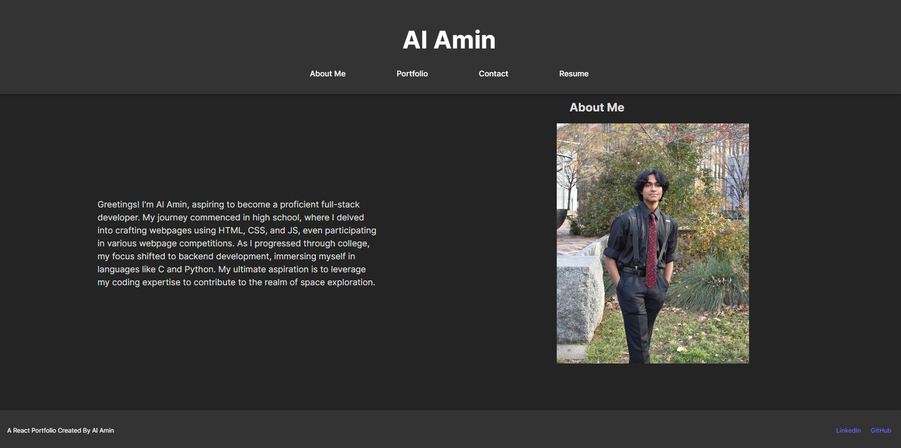
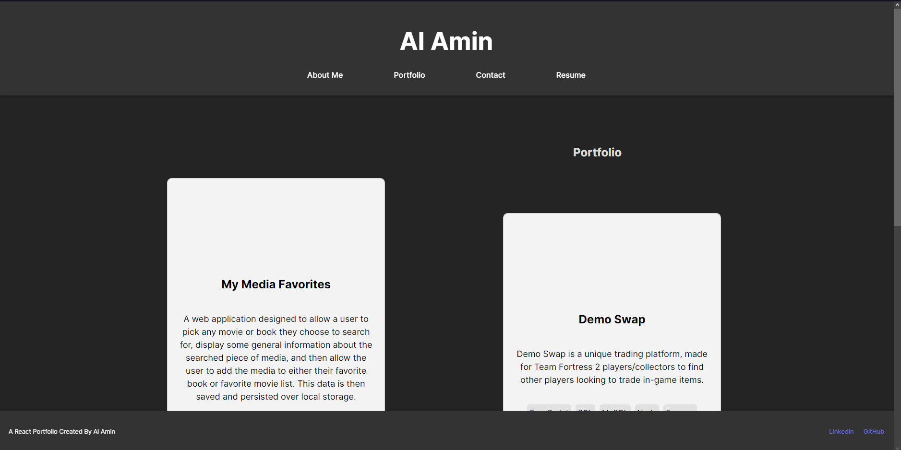
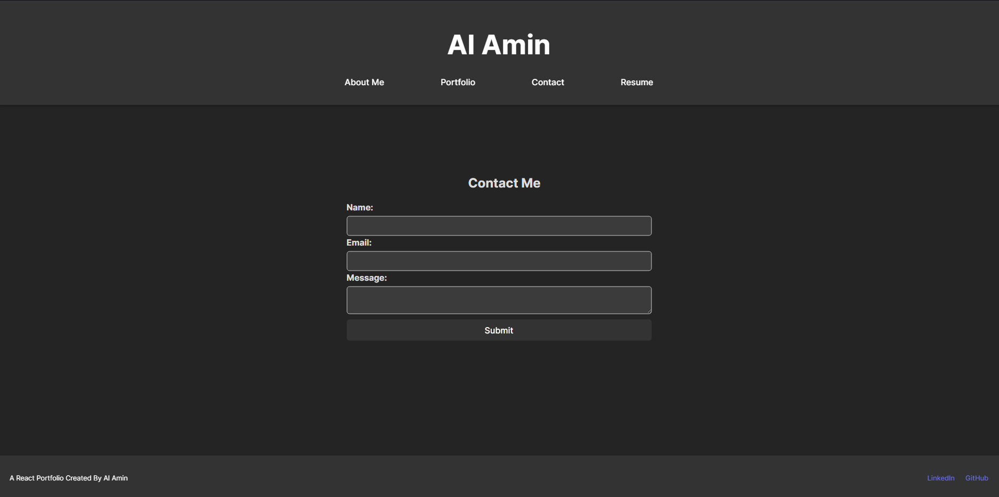
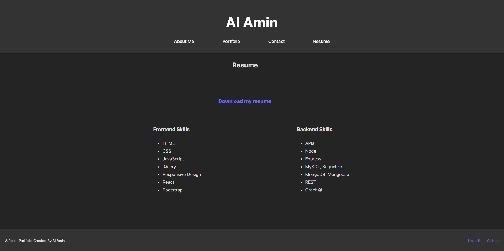

# Portfolio

## Description
This is a React Portfolio designed to keep a history of Al Amin's projects and accomplishments.

## Preview of The Program
[Portfolio Website](https://book-library-fe.netlify.app)

## Table of Contents
- [Installation](#installation)
- [Usage](#usage)
- [License](#license)
- [Contributing](#contributing)
- [Tests](#tests)
- [Questions](#questions)

## Installation
* Use Vite and choose react
* Nest npm I
* Lastly npm run dev

## Usage
The purpose of this react portfolio is so that employers can see who Al Amin is and the skills he has. 

## Contributing
I used Xpert Learning Assistant, starter code, and Slack Assistant. 

## Questions
If you have any questions, you can reach me at [GitHub: Unevailable](https://github.com/Unevailable) or contact me via email at al.amin003@hotmail.com.

## License
This project is licensed under the [MIT License license]([License Link](https://opensource.org/licenses/mit)).
